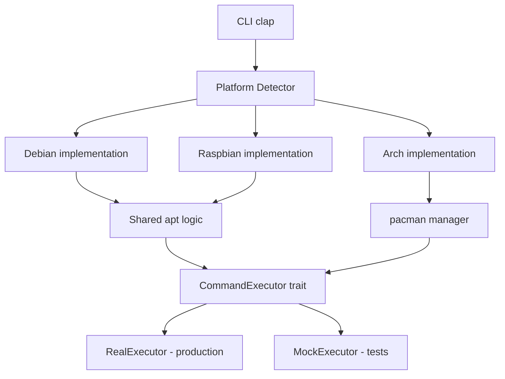

# 🧪 genesis-rs

**genesis-rs** est un outil de bootstrap et de configuration système agnostique développé en Rust. Il permet de provisionner, mettre à jour et configurer des instances Linux (Debian, Arch, Raspbian) de manière industrielle et automatisée.

## 🚀 Fonctionnalités Clés

- **📦 Gestion de Paquets Agnostique** : Interface unifiée pour `apt-get` (Debian/Raspbian) et `pacman` (Arch Linux).
- **🖥️ Dashboard Matériel** : Auto-inspection détaillée au lancement (CPU, RAM, Disques, OS Version) via `sysinfo`.
- **🛡️ Qualité de Code Automatisée** : Pre-commit hooks intégrés pour garantir le formatage (`rustfmt`), le linting (`clippy`) et la validation CI (`actionlint`).
- **🏗️ Build Multi-Arch** : Support natif pour x86_64 et ARM64 (via Distrobox pour les environnements immuables comme Bazzite).
- **🧪 E2E Testing Industriel** : Pipeline complet de test sur QEMU (Headless) avec injection Cloud-Init.
- **⏱️ Benchmarking & Profiling** : Mesure précise des temps de boot et de déploiement, intégrée directement dans la CI/CD.
- **🤖 CI/CD GitHub Actions** : Validation automatique de chaque commit sur les 3 distributions cibles.

## 🛠️ Architecture

Le projet repose sur un système de traits Rust (`SystemPlatform` + `CommandExecutor`) permettant d'abstraire les spécificités de chaque distribution tout en garantissant une cohérence opérationnelle et une testabilité complète.



## 🚦 Installation & Démarrage Rapide

### 1. Pré-requis système

Le projet nécessite des outils de virtualisation (QEMU), de cross-compilation (musl, GCC ARM) et de génération d'images (genisoimage). **Un script automatique installe tout** :

```bash
# Installer Rust + just (si pas déjà fait)
curl --proto '=https' --tlsv1.2 -sSf https://sh.rustup.rs | sh
cargo install just

# Cloner le projet
git clone https://github.com/yoyonel/genesis-rs.git
cd genesis-rs

# Installer TOUTES les dépendances système en une commande
just setup
```

Le script `just setup` détecte automatiquement votre distribution (Debian/Ubuntu, Fedora/Bazzite, Arch) et installe :

| Catégorie | Paquets installés |
|:---|:---|
| **Virtualisation** | `qemu-system-x86`, `qemu-system-arm`, `qemu-utils` |
| **Cloud Images** | `genisoimage` (génération des ISO Cloud-Init) |
| **EFI Firmware** | `qemu-efi-aarch64` (boot ARM64) |
| **Cross-compilation** | `musl-tools`, `gcc-aarch64-linux-gnu` |
| **Rust targets** | `x86_64-unknown-linux-musl`, `aarch64-unknown-linux-musl` |

Pour vérifier que tout est en place **sans rien installer** :
```bash
just setup-check
```

### 2. Premier lancement (5 minutes)

```bash
# Télécharger les images Cloud des 3 distros (~1-2 GB au total)
just provision-vms

# Compiler le binaire x86_64
just build

# Démarrer une VM Debian et y déployer genesis-rs
just boot-debian
just deploy-debian detect
```

### 3. Commandes du quotidien

```bash
just check          # Vérifier que le code compile
just test           # Lancer les 30 tests (unitaires + fonctionnels)
just lint           # Clippy + actionlint + vérification GitHub Actions
just format         # Formater le code (cargo fmt)

just boot-debian    # Démarrer une VM Debian (port SSH 22221)
just boot-arch      # Démarrer une VM Arch (port SSH 22222)
just boot-raspbian  # Démarrer une VM Raspbian ARM64 (port SSH 22223)
just deploy-debian  # Déployer et lancer bootstrap sur Debian
just clean-vms      # Arrêter toutes les VMs

just ci-local       # Pipeline CI complet en local (3 distros)
just benchmark      # Mesurer les performances de boot/deploy

just --list         # Voir toutes les recettes disponibles
```

> Pour le détail du pipeline E2E (Cloud-Init, QEMU, benchmarks), voir **[VM_SETUP.md](VM_SETUP.md)**.

## 📂 Structure du Projet

```
genesis-rs/
├── src/
│   ├── main.rs              # Point d'entrée CLI
│   ├── cli.rs               # Définition des commandes (clap)
│   ├── lib.rs               # Logique métier (app module)
│   ├── executor.rs          # Trait CommandExecutor (real + mock)
│   └── platform/
│       ├── mod.rs            # Trait SystemPlatform + détection OS + helpers apt partagés
│       ├── debian.rs         # Implémentation Debian
│       ├── arch.rs           # Implémentation Arch Linux
│       └── raspbian.rs       # Implémentation Raspberry Pi OS
├── tests/
│   ├── cli.rs               # Tests fonctionnels du binaire (assert_cmd)
│   └── e2e/
│       └── cloud-init/       # Configuration Cloud-Init pour VMs
├── scripts/
│   ├── setup-dev-env.sh      # Installation automatique des dépendances
│   ├── setup-build-env.sh    # Setup Distrobox ARM64 (Bazzite/Fedora)
│   ├── provision-vm.sh       # Provisionnement d'une image Cloud VM
│   ├── wait-ssh.sh           # Attente SSH (polling avec timeout)
│   ├── ci-test.sh            # Cycle E2E complet (boot → deploy → metrics)
│   └── benchmark.sh          # Benchmark boot + bootstrap
├── .github/workflows/
│   ├── ci.yml                # Pipeline CI (quality → build → E2E)
│   └── docs.yml              # Déploiement Rustdoc sur GitHub Pages
├── Justfile                  # Recettes de développement (organisées par section)
├── Cargo.toml                # Dépendances Rust
└── docs/                     # Documentation technique
```

## 🛡️ Standards de Développement

Pour maintenir une base de code saine, le projet impose :

1. **Formatage** : `cargo fmt` est obligatoire (`just format-check`).
2. **Linting** : `clippy` ne doit retourner aucune erreur ou warning (`just lint-rust`).
3. **CI Validation** : Les fichiers `.yml` de GitHub Actions sont validés par `actionlint` (`just lint-ci`).
4. **Tests** : 30 tests doivent passer (24 unitaires + 5 fonctionnels + 1 doctest) (`just test`).

Un **hook Git pre-commit** bloque tout commit ne respectant pas ces standards :
```bash
just install-hooks   # Installe le hook (fait automatiquement par just setup)
```

## 🤖 Pipeline CI/CD

Chaque push/PR déclenche une pipeline en 3 étapes :

```
quality (fmt + lint + test + cargo audit)
  └─→ build (x86_64 + ARM64 statiques)
        └─→ e2e-test (Debian + Arch + Raspbian en parallèle via QEMU)
```

La CI utilise les **mêmes recettes Justfile** que le développement local — pas de divergence.
