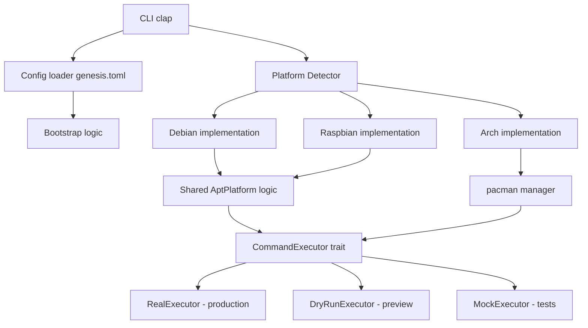

# 🧪 genesis-rs

[](https://github.com/yoyonel/genesis-rs/actions/workflows/ci.yml)
[](https://github.com/yoyonel/genesis-rs/releases/latest)
[](https://doc.rust-lang.org/cargo/reference/manifest.html#the-rust-version-field)
[](https://opensource.org/licenses/MIT)
[](https://yoyonel.github.io/genesis-rs/)

**genesis-rs** est un outil de bootstrap et de configuration système agnostique développé en Rust. Il permet de provisionner, mettre à jour et configurer des instances Linux (Debian, Arch, Raspbian) de manière industrielle et automatisée.

## 🚀 Fonctionnalités Clés

- **📦 Gestion de Paquets Agnostique** : Interface unifiée pour `apt-get` (Debian/Raspbian) et `pacman` (Arch Linux), avec validation des noms de paquets (whitelist `[a-zA-Z0-9.+-]`).
- **⚙️ Configuration TOML** : Listes de paquets personnalisables par plateforme via `genesis.toml` (voir [Configuration](#-configuration)).
- **🔍 Mode Dry-Run** : Prévisualisation des commandes sans exécution (`--dry-run`).
- **📊 Logging Structuré** : Traçabilité complète via `tracing` avec niveau configurable (`RUST_LOG` ou `--verbose`).
- **🖥️ Dashboard Matériel** : Auto-inspection détaillée au lancement (CPU, RAM, Disques, OS Version) via `sysinfo`.
- **🛡️ Qualité de Code Automatisée** : Pre-commit hooks intégrés pour garantir le formatage (`rustfmt`), le linting (`clippy`) et la validation CI (`actionlint`).
- **🏗️ Build Multi-Arch** : Support natif pour x86_64 et ARM64 (via Distrobox pour les environnements immuables comme Bazzite).
- **🧪 E2E Testing Industriel** : Pipeline complet de test sur QEMU (Headless) avec injection Cloud-Init et vérification d'intégrité SHA-256/SHA-512 des images.
- **⏱️ Benchmarking & Profiling** : Mesure précise des temps de boot et de déploiement, intégrée directement dans la CI/CD.
- **🤖 CI/CD GitHub Actions** : Validation automatique de chaque commit sur les 3 distributions cibles.
- **� Packaging Natif** : `.deb` via `cargo-deb` (Debian/Ubuntu) et PKGBUILD pour l'AUR (Arch Linux).
- **�🖥️ Gestion PID des VMs** : Suivi et nettoyage fiable des VMs QEMU par fichier PID (remplace `killall`).

## 🛠️ Architecture

Le projet repose sur un système de traits Rust (`SystemPlatform` + `CommandExecutor`) permettant d'abstraire les spécificités de chaque distribution tout en garantissant une cohérence opérationnelle et une testabilité complète.



## 🚦 Installation & Démarrage Rapide

### 1. Pré-requis système

Le projet nécessite des outils de virtualisation (QEMU), de cross-compilation (musl, GCC ARM) et de génération d'images (genisoimage). **Un script automatique installe tout** :

```bash
# Installer Rust + just (si pas déjà fait)
curl --proto '=https' --tlsv1.2 -sSf https://sh.rustup.rs | sh
cargo install just

# Cloner le projet
git clone https://github.com/yoyonel/genesis-rs.git
cd genesis-rs

# Installer TOUTES les dépendances système en une commande
just setup
```

Le script `just setup` détecte automatiquement votre distribution (Debian/Ubuntu, Fedora/Bazzite, Arch) et installe :

| Catégorie | Paquets installés |
|:---|:---|
| **Virtualisation** | `qemu-system-x86`, `qemu-system-arm`, `qemu-utils` |
| **Cloud Images** | `genisoimage` (génération des ISO Cloud-Init) |
| **EFI Firmware** | `qemu-efi-aarch64` (boot ARM64) |
| **Cross-compilation** | `musl-tools`, `gcc-aarch64-linux-gnu` |
| **Rust targets** | `x86_64-unknown-linux-musl`, `aarch64-unknown-linux-musl` |

Pour vérifier que tout est en place **sans rien installer** :
```bash
just setup-check
```

### 2. Premier lancement (5 minutes)

```bash
# Télécharger les images Cloud des 3 distros (~1-2 GB au total)
just provision-vms

# Compiler le binaire x86_64
just build

# Démarrer une VM Debian et y déployer genesis-rs
just boot-debian
just deploy-debian detect
```

### 3. Commandes du quotidien

```bash
just check          # Vérifier que le code compile
just test           # Lancer les 68 tests (unitaires + fonctionnels + doctest)
just lint           # Clippy + actionlint + vérification GitHub Actions
just format         # Formater le code (cargo fmt)
just doc            # Générer la documentation Rustdoc

just try-debian          # Build + boot + bootstrap + shell interactif sur Debian
just try-debian --reset  # Idem, avec overlay remis à zéro (VM vierge)
just try-arch            # Idem sur Arch
just try-raspbian        # Idem sur Raspbian ARM64

just ssh-debian          # SSH sur une VM Debian déjà lancée
just ssh-arch            # SSH sur une VM Arch déjà lancée
just ssh-raspbian        # SSH sur une VM Raspbian déjà lancée

just boot-debian         # Démarrer une VM Debian (port SSH 22221)
just boot-arch           # Démarrer une VM Arch (port SSH 22222)
just boot-raspbian       # Démarrer une VM Raspbian ARM64 (port SSH 22223)
just deploy-debian       # Déployer et lancer bootstrap sur Debian
just status-vms          # Afficher l'état des VMs (running/stale)
just clean-vms           # Arrêter toutes les VMs (PID-based, safe)

just ci-local            # Pipeline CI complet en local (3 distros)
just benchmark           # Mesurer les performances de boot/deploy

just package-deb         # Construire le paquet .deb (cargo-deb)
just package-arch        # Construire le paquet Arch (makepkg)

just --list         # Voir toutes les recettes disponibles
```

### 4. Tester le bootstrap sur une VM

La commande `just try-*` effectue tout le cycle : compilation, boot VM, déploiement, bootstrap, puis ouvre un shell interactif sur la VM bootstrappée :

```bash
# Tester sur Debian (réutilise l'overlay existant)
just try-debian

# Tester sur Debian avec VM vierge (idempotent)
just try-debian --reset

# Tester sur Arch / Raspbian
just try-arch --reset
just try-raspbian --reset
```

Une fois dans le shell, `genesis-rs` est disponible à `/tmp/genesis-rs`. Taper `exit` pour quitter — la VM reste en vie. Pour se reconnecter :

```bash
just ssh-debian     # Reconnexion simple à une VM déjà lancée
```

Pour arrêter les VMs : `just clean-vms`.

> Pour le détail du pipeline E2E (Cloud-Init, QEMU, benchmarks), voir **[VM_SETUP.md](VM_SETUP.md)**.

## 📖 Référence CLI

```
genesis-rs [OPTIONS] <COMMAND>
```

### Commandes

| Commande | Description |
|:---|:---|
| `bootstrap` | Provisionne le système : mise à jour + installation des paquets configurés |
| `detect` | Détecte l'OS et affiche le résumé matériel (CPU, RAM, disques) |

### Options globales

| Option | Description |
|:---|:---|
| `--dry-run` | Prévisualise les commandes sans les exécuter. Affiche `[dry-run] cmd args` sur stdout |
| `-v, --verbose` | Active les logs de niveau DEBUG (détection plateforme, chargement config…) |
| `--config <PATH>` | Chemin vers un fichier de configuration TOML (défaut : `genesis.toml`) |
| `-h, --help` | Affiche l'aide |
| `-V, --version` | Affiche la version |

### Exemples

```bash
# Bootstrap standard
genesis-rs bootstrap

# Prévisualiser les commandes sans rien exécuter
genesis-rs --dry-run bootstrap

# Utiliser un fichier de configuration personnalisé
genesis-rs --config /etc/genesis/custom.toml bootstrap

# Détecter l'OS et afficher le résumé matériel
genesis-rs detect
```

### Logging

genesis-rs utilise `tracing` pour le logging structuré. Les logs sont écrits sur **stderr** (ne pollue pas stdout).

Le niveau de log est contrôlé par la variable d'environnement `RUST_LOG` :

```bash
# Niveau par défaut : info pour genesis-rs
genesis-rs detect

# Mode verbose : active le niveau debug (équivalent de RUST_LOG=genesis_rs=debug)
genesis-rs -v detect

# Activer le debug via variable d'environnement (prend la priorité sur -v)
RUST_LOG=genesis_rs=debug genesis-rs bootstrap

# Activer le trace pour tout voir
RUST_LOG=trace genesis-rs --dry-run bootstrap
```

## ⚙️ Configuration

genesis-rs peut être configuré via un fichier TOML. Par défaut, il cherche `genesis.toml` dans le répertoire courant. Si le fichier est absent, des valeurs par défaut sont utilisées.

### Fichier de configuration (`genesis.toml`)

```toml
# genesis-rs configuration
# Personnalise les listes de paquets par plateforme.
# Si ce fichier est absent, les valeurs par défaut intégrées sont utilisées.

[packages]
# Paquets installés sur toutes les plateformes
common = ["git", "curl", "vim", "htop"]

# Paquets additionnels pour Debian
debian = ["build-essential", "nginx"]

# Paquets additionnels pour Arch Linux
arch = ["base-devel"]

# Paquets additionnels pour Raspberry Pi OS
raspbian = ["rpi-update"]
```

### Comportement

| Scénario | Résultat |
|:---|:---|
| Pas de `genesis.toml` et pas de `--config` | Paquets par défaut : `git`, `curl`, `vim`, `htop` |
| `genesis.toml` présent | Chargé automatiquement |
| `--config path/to/file.toml` | Charge le fichier spécifié (erreur si introuvable) |
| Champ manquant dans le TOML | Valeurs par défaut pour les champs absents (ex: `common` par défaut si non spécifié) |
| TOML invalide | Erreur avec message descriptif |

Les paquets sont mergés : `common` + paquets spécifiques à la plateforme détectée. Par exemple, sur Debian avec la config ci-dessus : `git`, `curl`, `vim`, `htop`, `build-essential`, `nginx`.

Un fichier d'exemple est fourni : [`genesis.toml.example`](genesis.toml.example).

## 📂 Structure du Projet

```
genesis-rs/
├── src/
│   ├── main.rs              # Point d'entrée CLI + initialisation tracing
│   ├── cli.rs               # Définition des commandes et options globales (clap)
│   ├── lib.rs               # Logique métier (bootstrap, detect)
│   ├── config.rs            # Chargement de la configuration TOML
│   ├── executor.rs          # Trait CommandExecutor (real + dry-run + mock)
│   └── platform/
│       ├── mod.rs            # Trait SystemPlatform + AptPlatform + détection OS + validation
│       ├── debian.rs         # Implémentation Debian
│       ├── arch.rs           # Implémentation Arch Linux
│       └── raspbian.rs       # Implémentation Raspberry Pi OS
├── tests/
│   ├── cli.rs               # Tests fonctionnels du binaire (assert_cmd)
│   └── e2e/
│       └── cloud-init/       # Configuration Cloud-Init pour VMs
├── scripts/
│   ├── setup-dev-env.sh      # Installation automatique des dépendances
│   ├── setup-build-env.sh    # Setup Distrobox ARM64 (Bazzite/Fedora)
│   ├── provision-vm.sh       # Provisionnement d'une image Cloud VM (+ vérification checksum)
│   ├── boot-vm.sh            # Boot d'une VM QEMU avec gestion PID
│   ├── wait-ssh.sh           # Attente SSH (polling avec timeout)
│   ├── ci-test.sh            # Cycle E2E complet (boot → deploy → metrics)
│   ├── benchmark.sh          # Benchmark boot + bootstrap
│   ├── clean-vms.sh          # Arrêt de toutes les VMs via PID files
│   ├── status-vms.sh         # Affichage de l'état des VMs (running/stale)
│   ├── try-vm.sh             # Workflow complet : build → boot → deploy → bootstrap → shell
│   ├── reset-overlay.sh      # Reset overlay VM à l'état pristine
│   └── provision-setup.sh    # Génération de clé SSH E2E (idempotent)
├── packaging/
│   └── arch/
│       └── PKGBUILD          # PKGBUILD pour l'AUR (Arch Linux)
├── genesis.toml.example      # Exemple de configuration TOML
├── LICENSE                   # Licence MIT
├── .github/
│   ├── copilot-instructions.md  # Directives pour GitHub Copilot
│   ├── instructions/            # Instructions contextuelles (commits, tests, GitHub)
│   └── workflows/
│       ├── ci.yml               # Pipeline CI (quality → build → E2E)
│       ├── release.yml          # Release (binaires + .deb → GitHub Releases)
│       └── docs.yml             # Déploiement Rustdoc sur GitHub Pages
├── Justfile                  # Recettes de développement (organisées par section)
├── Cargo.toml                # Dépendances Rust (+ metadata cargo-deb)
└── docs/                     # Documentation technique
```

## 🛡️ Standards de Développement

Pour maintenir une base de code saine, le projet impose :

1. **Formatage** : `cargo fmt` est obligatoire (`just format-check`).
2. **Linting** : `clippy` ne doit retourner aucune erreur ou warning (`just lint-rust`).
3. **CI Validation** : Les fichiers `.yml` de GitHub Actions sont validés par `actionlint` (`just lint-ci`).
4. **Tests** : 68 tests doivent passer (50 unitaires + 17 fonctionnels + 1 doctest) (`just test`).
5. **Documentation** : `cargo doc --no-deps` doit compiler sans warnings. Tous les items `pub` ont des `///` docs.
6. **Sécurité** : `cargo audit` ne doit pas présenter de vulnérabilités connues.
7. **Validation des entrées** : Les noms de paquets sont validés par whitelist (`[a-zA-Z0-9.+-]`, max 256 caractères).

Un **hook Git pre-commit** bloque tout commit ne respectant pas ces standards :
```bash
just install-hooks   # Installe le hook (fait automatiquement par just setup)
```

## 🤖 Pipeline CI/CD

Chaque push/PR déclenche une pipeline en 8 jobs :

```
quality (stable)  ─┐
quality (MSRV)    ─┤──→ build (x86_64 + ARM64 statiques) ──→ e2e ×3 (Debian, Arch, Raspbian)
security          ─┘
coverage          ─── (parallèle, indépendant)
```

- **Coverage** : `cargo-tarpaulin` avec rapport HTML en artifact
- **Release** : le push d'un tag `v*` déclenche un build multi-arch et crée une [GitHub Release](https://github.com/yoyonel/genesis-rs/releases) avec les binaires statiques

La CI utilise les **mêmes recettes Justfile** que le développement local — pas de divergence.

## 📚 Documentation

La documentation Rustdoc est générée et déployée automatiquement sur GitHub Pages à chaque push sur `master` :

**→ [https://yoyonel.github.io/genesis-rs/](https://yoyonel.github.io/genesis-rs/)**

## 🤝 Contributing

See [CONTRIBUTING.md](CONTRIBUTING.md) for development setup, workflow, and coding standards.

## 📋 Changelog

See [CHANGELOG.md](CHANGELOG.md) for a detailed list of changes per release.
