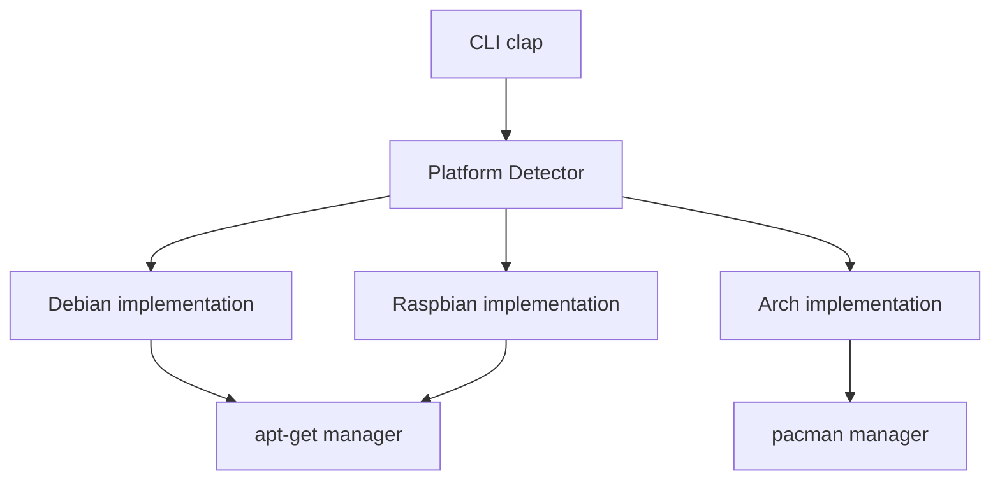

# 🧪 genesis-rs

**genesis-rs** est un outil de bootstrap et de configuration système agnostique développé en Rust. Il permet de provisionner, mettre à jour et configurer des instances Linux (Debian, Arch, Raspbian) de manière industrielle et automatisée.

## 🚀 Fonctionnalités Clés

- **📦 Gestion de Paquets Agnostique** : Interface unifiée pour `apt-get` (Debian/Raspbian) et `pacman` (Arch Linux).
- **🖥️ Dashboard Matériel** : Auto-inspection détaillée au lancement (CPU, RAM, Disques, OS Version) via `sysinfo`.
- **🛡️ Qualité de Code Automatisée** : Pre-commit hooks intégrés pour garantir le formatage (`rustfmt`), le linting (`clippy`) et la validation CI (`actionlint`).
- **🏗️ Build Multi-Arch** : Support natif pour x86_64 et ARM64 (via Distrobox pour les environnements immuables comme Bazzite).
- **🧪 E2E Testing Industriel** : Pipeline complet de test sur QEMU (Headless) avec injection Cloud-Init.
- **⏱️ Benchmarking & Profiling** : Mesure précise des temps de boot et de déploiement, intégrée directement dans la CI/CD.
- **🤖 CI/CD GitHub Actions** : Validation automatique de chaque commit sur les 3 distributions cibles.

## 🛠️ Architecture

Le projet repose sur un système de traits Rust (`SystemPlatform`) permettant d'abstraire les spécificités de chaque distribution tout en garantissant une cohérence opérationnelle.



## 🚦 Démarrage Rapide

### Pré-requis
- Rust (dernière édition)
- `just` (runner de commandes)
- QEMU & genisoimage (pour les tests E2E)

### Commandes Utiles
```bash
# Compiler le projet
just build

# Provisionner les VMs de test
just provision-vms

# Lancer la détection sur l'hôte
cargo run -- detect

# Lancer le pipeline CI complet en local (Debian + Arch + Raspbian)
just ci-local

# Vérifier la qualité du code (Linting)
just lint
```

## 🛡️ Standards de Développement

Pour maintenir une base de code saine, le projet impose :
1. **Formatage** : `cargo fmt` est obligatoire.
2. **Linting** : `clippy` ne doit retourner aucune erreur ou warning.
3. **CI Validation** : Les fichiers `.yml` de GitHub Actions sont validés par `actionlint`.

Un **hook Git pre-commit** est automatiquement utilisé pour bloquer tout commit ne respectant pas ces standards.
